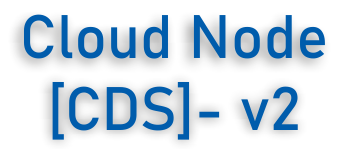

* Hybrid MN/PoS algorithm
* Dynamic masternode
* Very Low MAX Supply
* Segwit
* X11 PoS hybrid algorithm

## CloudNode-v2 Specifications

## Build Instructions

Build cloudnode-v2 wallet
----------

### Building for 32-bit Windows

The next three steps are an example of how to acquire the source and build in an appropriate way.
        
Acquire the source and install dependencies.

    git clone https://github.com/udaydeep1992/cloudnode-v2
    sudo chmod -R a+rw cloudnode-v2
    cd cloudnode-v2
	
	PATH=$(echo "$PATH" | sed -e 's/:\/mnt.*//g')
	
	cd depends
    ./install-deps.sh
    
Set the default mingw-w32 g++ compiler option to auto (option 0) by default.

    sudo update-alternatives --config i686-w64-mingw32-g++
    
Build in the usual way.

    make HOST=i686-w64-mingw32 -j4 && cd .. && ./autogen.sh && ./configure --prefix `pwd`/depends/i686-w64-mingw32 &&  make
    
### Building for 64-bit Windows   

The next three steps are an example of how to acquire the source and build in an appropriate way.
        
Acquire the source and install dependencies.

    git clone https://github.com/udaydeep1992/cloudnode-v2
    sudo chmod -R a+rw cloudnode-v2
    cd cloudnode-v2
	
	PATH=$(echo "$PATH" | sed -e 's/:\/mnt.*//g')
	
	cd depends
    ./install-deps.sh
    
Set the default mingw-w64 g++ compiler option to posix (option 1).

    sudo update-alternatives --config x86_64-w64-mingw32-g++
    
Build in the usual way.

    make HOST=x86_64-w64-mingw32 -j4 && cd .. && ./autogen.sh && ./configure --prefix `pwd`/depends/x86_64-w64-mingw32 &&  make

### Build on Ubuntu

Use

 sudo apt-get update -y && sudo apt-get upgrade -y && sudo apt-get install git -y && sudo apt-get install libzmq3-dev && sudo apt-get install build-essential libboost-all-dev libqrencode-dev pkg-config libminiupnpc-dev qt5-default qttools5-dev-tools libgmp3-dev -y && sudo add-apt-repository ppa:bitcoin/bitcoin -y && sudo apt-get update -y && sudo apt-get install libdb4.8-dev libdb4.8++-dev -y && sudo apt-get install libtool autotools-dev autoconf automake -y && sudo apt-get install libzmq3-dev libminiupnpc-dev libssl-dev libevent-dev -y && sudo apt-get install libgmp-dev -y && sudo apt-get install openssl -y && sudo apt-get update -y && sudo apt-get install aptitude -y && sudo aptitude install libdb4.8++-dev -y && sudo apt-get install software-properties-common python-software-properties -y

Build cloudnode-v2 

    cd cloudnode-v2
    ./depends/install-deps.sh
    ./autogen.sh
    ./configure --disable-tests
    make -j$(nproc)

### Build on OSX

The commands in this guide should be executed in a Terminal application.
The built-in one is located in `/Applications/Utilities/Terminal.app`.

#### Preparation

Install the OS X command line tools:

`xcode-select --install`

When the popup appears, click `Install`.

If you're running macOS Mojave 10.14/Xcode 10.0 or later, and want to use the depends system, you'll also need to use the following script to install the macOS system headers into /usr/include.

    open /Library/Developer/CommandLineTools/Packages/macOS_SDK_headers_for_macOS_10.14.pkg

Then install [Homebrew](https://brew.sh)

    /usr/bin/ruby -e "$(curl -fsSL https://raw.githubusercontent.com/Homebrew/install/master/install)"

#### Dependencies

    brew install cmake automake berkeley-db4 leveldb libtool boost@1.64 --c++11 --without-single --without-static miniupnpc openssl pkg-config protobuf qt5 libevent imagemagick --with-librsvg

Link boost 1.64

    brew link boost@1.64 --force

#### Build cloudnode-v2core

Clone the cloudnode-v2 source code and cd into cloudnode-v2

        git clone https://github.com/udaydeep1992/cloudnode-v2
        cd cloudnode-v2
        ./building/mac/requirements.sh
        ./building/mac/build.sh

Setup and Build: Arch Linux
-----------------------------------
This example lists the steps necessary to setup and build a command line only, non-wallet distribution of the latest changes on Arch Linux:

    pacman -S git base-devel boost libevent python
    git clone https://github.com/udaydeep1992/cloudnode-v2
    cd cloudnode-v2/
    ./autogen.sh
    ./configure --without-miniupnpc --disable-tests
    make -j$(nproc)

Note:
Enabling wallet support requires either compiling against a Berkeley DB newer than 4.8 (package `db`) using `--with-incompatible-bdb`,
or building and depending on a local version of Berkeley DB 4.8. The readily available Arch Linux packages are currently built using
`--with-incompatible-bdb` according to the
As mentioned above, when maintaining portability of the wallet between the standard Bitcoin Core distributions and independently built
node software is desired, Berkeley DB 4.8 must be used.

ARM Cross-compilation
-------------------
These steps can be performed on, for example, an Ubuntu VM. The depends system
will also work on other Linux distributions, however the commands for
installing the toolchain will be different.

Make sure you install the build requirements mentioned above.
Then, install the toolchain and curl:

    sudo apt-get install g++-arm-linux-gnueabihf curl

To build executables for ARM:

    cd depends
    make HOST=arm-linux-gnueabihf NO_QT=1
    cd ..
    ./configure --prefix=$PWD/depends/arm-linux-gnueabihf --enable-glibc-back-compat --enable-reduce-exports LDFLAGS=-static-libstdc++
    make -j$(nproc)

For further documentation on the depends system see [README.md](../depends/README.md) in the depends directory.

Building on FreeBSD
--------------------

Clang is installed by default as `cc` compiler, this makes it easier to get
started than on [OpenBSD](build-openbsd.md). Installing dependencies:

    pkg install autoconf automake libtool pkgconf
    pkg install boost-libs openssl libevent
    pkg install gmake

You need to use GNU make (`gmake`) instead of `make`.
(`libressl` instead of `openssl` will also work)

For the wallet (optional):

    ./contrib/install_db4.sh `pwd`
    setenv BDB_PREFIX $PWD/db4

Then build using:

    ./autogen.sh
    ./configure BDB_CFLAGS="-I${BDB_PREFIX}/include" BDB_LIBS="-L${BDB_PREFIX}/lib -ldb_cxx"
    gmakecloudnode-v2 (cloudnode-v2) an open source cryptocurrency and globally accessible payment network, with a highly-scalable, hyper-fast, low-fee transaction profile. The cloudnode-v2 network features a low-barrier, fully democratized governance mechanism, user-friendly cross-platform clients for universal adoption and a large-scale masternode network supporting a diverse set of services available to network participants. To secure its network, cloudnode-v2 utilizes a X11-based Proof of Work consensus algorithm, to be later switched over to an environmentally-friendly Proof of Stake. Masternode operators are compensated for the services they provide, as are miners and stakers for cryptographically validating transaction on the network.
cloudnode-v2 (CDS) an open source cryptocurrency and globally accessible payment network, with a highly-scalable, hyper-fast, low-fee transaction profile. The cloudnode-v2 network features a low-barrier, fully democratized governance mechanism, user-friendly cross-platform clients for universal adoption and a large-scale masternode network supporting a diverse set of services available to network participants. To secure its network, cloudnode-v2 utilizes a X11-based Proof of Work consensus algorithm, to be later switched over to an environmentally-friendly Proof of Stake. Masternode operators are compensated for the services they provide, as are miners and stakers for cryptographically validating transaction on the network.
